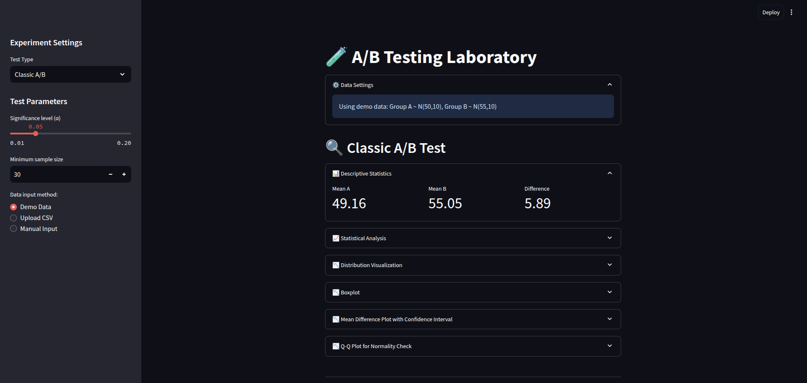
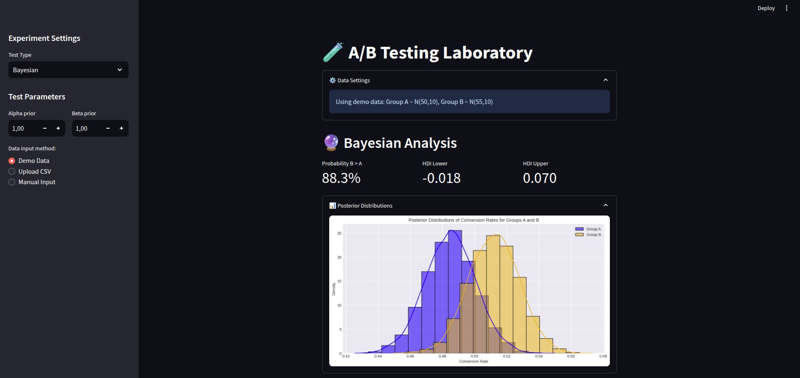
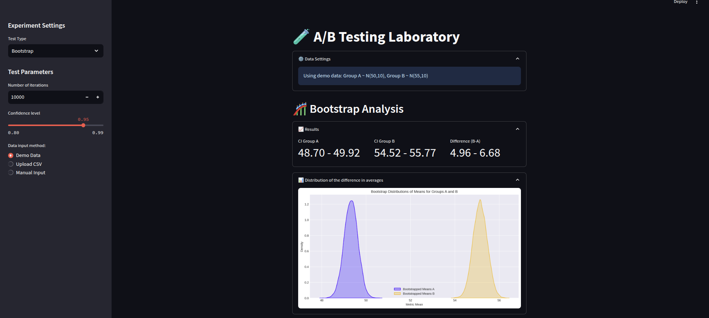
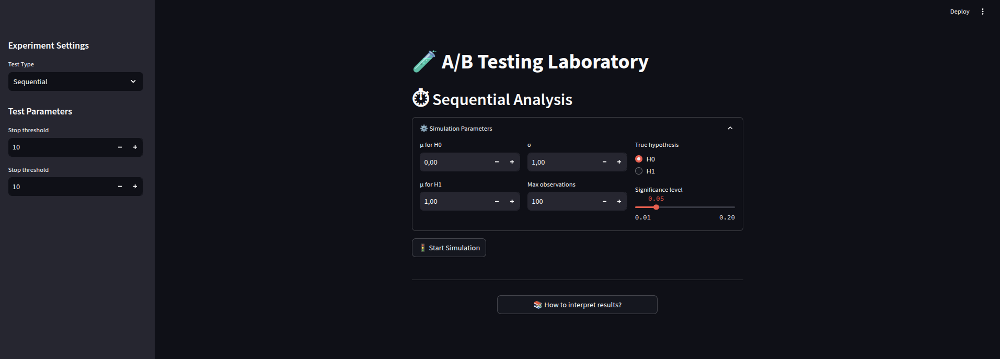

# A/B Testing Laboratory 🧪
[](https://your-app-url.streamlit.app/)

A/B Testing Laboratory is an interactive web app built with Streamlit that empowers users to perform **classic, Bayesian, bootstrap, and sequential A/B tests** with ease. Whether you're a data scientist, researcher, or marketer, this tool provides a one-stop solution for robust statistical analysis, dynamic visualizations, and actionable insights.  

---
## 🚀 Key Features  

### **1. Multiple Testing Methods**  
- **Classic A/B Testing**: T-tests, Mann-Whitney U-tests, normality/variance checks, and effect size (Cohen’s d).  
- **Bayesian Testing**: Posterior distributions, HDI intervals, and probability of B > A.  
- **Bootstrap Analysis**: Non-parametric confidence intervals and difference distributions.  
- **Sequential Testing**: Early stopping with SPRT (Sequential Probability Ratio Test).  
- **Experiment Comparison**: Compare multiple A/B tests side-by-side.  

### **2. Interactive & User-Friendly**  
- 📊 **Dynamic Visualizations**: QQ-plots, boxplots, KDEs, ECDFs, and confidence interval plots.  
- 📥 **Flexible Data Input**: Upload CSV files, use demo data, or manually enter values.  
- 📉 **Real-Time Results**: Instantly visualize distributions, p-values, and effect sizes.  

### **3. Advanced Utilities**  
- 📚 **Built-in Guidelines**: Interpret results with explanations of p-values, test selection tips, and statistical concepts.  
- 📦 **Export Results**: Download summaries and graphs for reporting.  
- ⚡ **Power Analysis**: Estimate required sample sizes for desired test power.  

### **4. Streamlit-Powered UI**  
- Responsive, wide-mode layout optimized for data exploration.  
- Sidebar controls for test parameters and data input.  

---

## 🛠️ How to Use  

### **Installation**  
1. Clone the repository:  
   ```bash  
   git clone https://github.com/Blase-AI/A-B-Testing-Laboratory.git  
   cd A-B-Testing-Laboratory
   ```
2. Clone the repository:
   ```bash
   pip install -r requirements.txt  
   ```
## 🚀Launch the App
  ```bash
  streamlit run streamlit_app.py  
  ```
## Steps to Run a Test
1. Select a test type (e.g., Bayesian, Bootstrap) from the sidebar.
2. Upload data (CSV), use demo data, or input values manually.
3. Adjust parameters (e.g., significance level, priors, bootstrap iterations).
4. Explore results: Interactive plots, metrics, and summaries will auto-update.
5. Compare experiments or export results as CSV.

## Examples
You can also explore examples in the examples folder. Inside, you'll find classic types of tests implemented in Jupyter notebooks using popular libraries. These examples demonstrate similar results and provide a practical reference for understanding how the test work in different contexts.

## 🎯 Why This Project Stands Out
- All-in-One Testing: No need to switch between tools—compare methods in one interface.
- Educational Tool: Guidelines and visualizations make complex stats accessible.
- Production-Ready: Built with modular classes (ABTest, BayesianABTest, etc.) for easy extension.

## 📸 Screenshots
### Classic A/B Test  
  
*Classic A/B test*  

### Bayesian Results  
  
*Bayesian*  

### Bootstrap Results  
  
*Bootstrap*  

### Sequential Results  
  
*Sequential*  
